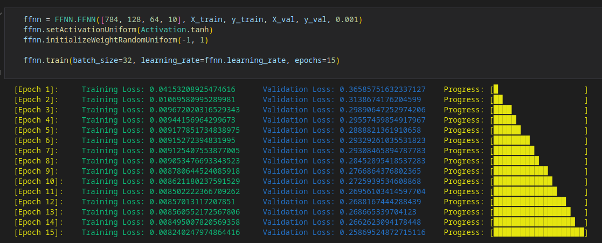

# Deskripsi Singkat

Repo terkait implementasi FFNN from scratch, menggunakan forward propagation dan backward propagation. Implementasi menggunakan matriks untuk merepresentasikan variabel-variabel jaringan, dan perkalian matriks sebagai operasi-operasi jaringan untuk membuat kode lebih singkat.

Pada repo sudah tersedia notebook untuk melakukan testing model pada file `testing.ipynb` dan `training.ipynb`

# Setup dan Run
* Notebook yang ada pada repo sudah tersedia source code yang sudah siap dijalankan. `training` berisi kode untuk membuat dan melatih model, sedangkan `testing` untuk mengetes kinerja model.
* Source code untuk algoritma FFNN dan algoritma lainnya terdapat pada folder `lib`
* Cara untuk import dari `lib` terdapat pada notebook dan file-file testing
# Anggota Kelompok

| NIM | Nama | Tugas |
|-----|------|-------|
|13522127 | Maulana Muhamad Susetyo| Tampilan struktur FFNN, save dan load, implementasi softmax dan turunan, binary cross entropy|
| 13522138|Andi Marihot Sitorus|Distribusi bobot dan gradien, tampilan loss epoch, categorical cross entropy |
|13522158 |Muhammad Rasheed Qais Tandjung | Rancangan algoritma forward propagation dan backward propagation, rancangan kelas FFNN, serta kelas-kelas dan fungsi bantuan, setup notebook|